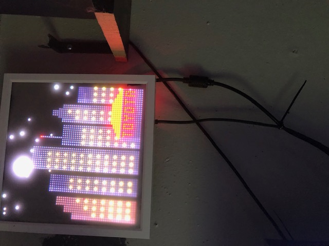
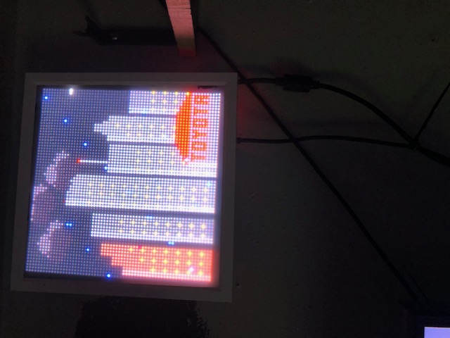

# HOU-Skyline-Clock
The Houston PiClock: A 64x64 LED matrix weather simulator. Features a procedural Houston skyline with a glowing Toyota Center (TC) sign. Unlike static clocks, the sun, moon, and spaced-out storm clouds follow a real-time orbital arc, creating a "digital sundial" driven by OpenWeatherMap API and Python.

🚀 SpaceCity-Orbital-ClockA high-fidelity Raspberry Pi weather simulator and digital sundial designed for a 64x64 RGB LED Matrix. This project treats the LED matrix as a "digital window" into downtown Houston, featuring a procedurally drawn skyline and advanced celestial physics.🌟 Key FeaturesReal-Time Orbital Engine: Unlike static weather apps, the Sun, Moon, and weather formations (Cloud Clusters, Rain, Storms) follow a mathematically calculated arc across the sky. This creates a "digital sundial" where you can estimate the time of day based on the icon's horizontal position.The Toyota Center (TC) Landmark: A custom-coded silhouette of the Toyota Center, featuring a glowing "TC" (Toyota) sign. The signage and window lighting are dynamic, featuring a signature red night-time illumination cycle.Spaced-Out Weather Dynamics: Heavy weather (Overcast, Rain, Storms) is rendered as a formation of three sun-sized clouds that drift together along the orbital path, providing a more natural and immersive "front" than a single icon.High-Accuracy Lunar Tracking: Includes a real-time Moon Phase engine calibrated to the day of the year for precise rendering of waxing and waning cycles.Live Atmospheric Elements: Integrated support for randomized airplane strobe lights, shooting stars, and weather-dependent lightning strikes that originate from the moving cloud clusters.🛠️ Hardware RequirementsRaspberry Pi (Tested on Pi 4 / Pi 5)64x64 RGB LED Matrix (P3 or P2.5)Adafruit RGB Matrix Bonnet or HATHigh-performance power supply (5V 4A+ recommended)💻 Installation & SetupClone the Repository:Bashgit clone https://github.com/boxcar32/HOU-Skyline-Clock.git
cd SpaceCity-Orbital-Clock
Install Dependencies:Ensure you have the rpi-rgb-led-matrix library installed, then install the Python requests module:Bashpip install requests
Configure API & Location:Open the main script and update the following variables with your own credentials:API_KEY: Your OpenWeatherMap API key.LAT / LON: Your specific coordinates (Defaulted to Houston, TX).Run the Simulation:Bashsudo python3 piclock.py --led-cols=64 --led-rows=64 --led-slowdown-gpio=4
🎨 Visual LogicThe skyline is drawn procedurally, meaning no images are loaded. The Toyota Center and surrounding skyscrapers are built using geometric coordinates, allowing for maximum clarity on a 64x64 resolution. The "TC" sign uses a sine-wave pulse ($180 + 75 \sin(t \times 3)$) to simulate the glow of real neon.📜 LicenseThis project is released under the MIT License. Feel free to fork it and adapt the skyline for your own city!
